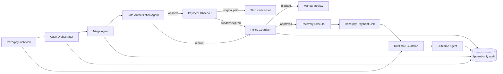

# MendPay architecture

## Design principle

The model can interpret evidence. It cannot decide money, status, timing, or execute an external action. Every model decision passes through deterministic policy before a Razorpay tool is reachable.

## Agent contracts

All boundaries use Pydantic models. This makes the modular monolith easy to split into queue consumers later without changing the workflow contract.

| Component | Owns | Must not do |
|---|---|---|
| Case Orchestrator | State transitions and deadlines | Interpret free-form failure text |
| Triage Agent | Structured failure classification | Call Razorpay or change amounts |
| Late-Authorization Agent | Observe/recover/review recommendation | Mark a payment paid |
| Payment Observer | Razorpay status evidence | Choose customer messaging |
| Policy Guardian | Consent, status, contact, link and amount invariants | Use probabilistic judgment |
| Recovery Executor | Approved Payment Link create/cancel calls | Bypass policy |
| Duplicate Guardian | Correlate original and recovery captures | Issue refunds |
| Outcome Agent | Recovery and safety metrics | Rewrite history |

## Failure behavior

- OpenAI timeout or invalid schema: manual review; observation continues.
- Razorpay status check failure: no link creation; manual review.
- Duplicate webhook: idempotently ignored.
- Late original capture: pending recovery stops and unpaid link is cancelled.
- Both payments captured: freeze actions and prepare a human-reviewed refund recommendation.
- App restart: API cases and webhook IDs remain in SQLite.

## Production scaling path

Replace the in-process calls with a durable workflow engine and partitioned event queue keyed by merchant and order. Move SQLite to Postgres, keep workers stateless, preserve idempotency keys, and scale observers independently from model-backed triage. The typed contracts and centralized Policy Guardian remain unchanged.
