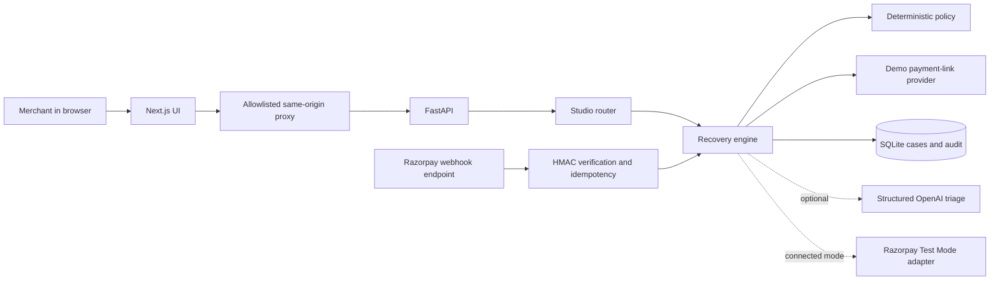
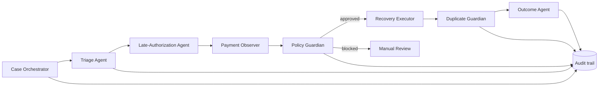

# MendPay demo and five-minute video runbook

This document is the source of truth for running and presenting the current prototype. It distinguishes what works today from the production architecture proposed for later.

## 1. What the project does

MendPay handles the race between a `payment.failed` event and a payment that may still authorize later. It classifies a failure, observes ambiguous bank or gateway failures, requires merchant approval before creating a recovery link, stops recovery if the original payment succeeds, and flags a duplicate when both payment paths capture.

The differentiator is not merely retrying a payment. It is deciding when to wait, when to recover, and when to stop while preserving an audit trail.

## 2. Honest implementation status

- The Next.js landing page and recovery workspace are working locally.
- The FastAPI API, state machine, policy guardrails, SQLite persistence, webhook signature validation, idempotency checks, simulator, and automated tests are implemented.
- The React studio is deliberately isolated: it uses a simulated payment-link provider and never moves money or contacts customers.
- A Razorpay Payment Links adapter exists and can use Test Mode credentials through environment variables. It is not exercised by the React studio.
- OpenAI-based structured triage is optional. Without an API key, deterministic classification is used and unknown evidence fails closed to manual review.
- The named agents are bounded software roles in a modular monolith today, not independently deployed network services.

Do not describe the current prototype as a production system, a causal revenue experiment, or a live autonomous multi-agent deployment.

## 3. Hardcoded-value audit

The project contains **no committed API keys, passwords, webhook secrets, or Razorpay credentials**. Secret fields in `.env.example` are empty and `.env` is ignored by Git.

It does contain intentional fixed demo and policy values:

| Value | Location | Why it is fixed now | Production treatment |
|---|---|---|---|
| Twelve demo orders, amounts and failure reasons | `saferecover/studio.py` | Reproducible video and UI states | Replace with tenant-scoped test fixtures or real events |
| Demo merchant `studio_simulation` | `saferecover/studio.py` | Keeps studio records isolated | Derive merchant identity from authenticated tenant context |
| 15-minute observation window | `saferecover/policy.py` | Safe prototype default | Versioned merchant/risk policy stored in configuration |
| Two-contact cap | `saferecover/policy.py` | Demonstrates a customer-contact guardrail | Configurable consent and channel policy |
| Transient and hard-failure reason sets | `saferecover/policy.py` | Deterministic, explainable classification | Versioned policy rules informed by provider evidence |
| 120 records, random seed 42 and simulation probabilities | `saferecover/simulator.py` | Makes the comparison repeatable | Replace with held-out, timestamped merchant data and documented sampling |
| Local ports 8000, 3000 and 8501 | frontend and run commands | Development defaults | Deployment URLs and environment configuration |
| `Demo merchant`, displayed policy values and explanatory copy | React components | Makes the sandbox understandable | Load tenant name and policies from the API |
| SQLite path and default model | environment defaults | Convenient local startup | Managed database and deployment-specific model configuration |

The accurate statement for judges is: **“MendPay has no embedded credentials. It uses intentionally hardcoded, clearly labelled fixtures for a deterministic sandbox; production-sensitive values are environment-driven, while policy defaults still need to become versioned merchant configuration.”**

## 4. Prerequisites

- Windows PowerShell
- Python 3.11 or newer
- Node.js 20 or newer
- `pnpm`

Clone and enter the repository:

```powershell
git clone https://github.com/AAbhinVV/MendPay.git
Set-Location MendPay
```

Install the Python dependencies:

```powershell
py -3.12 -m venv .venv
.\.venv\Scripts\python.exe -m pip install -r requirements.txt
```

Install the frontend dependencies:

```powershell
Set-Location frontend
pnpm install --frozen-lockfile
Set-Location ..
```

If `pnpm` is unavailable, install it with `npm install --global pnpm` and reopen PowerShell.

## 5. Start a clean video environment

Use a separate database so recording experiments never alter another local database.

### Terminal 1 — API

Run from the repository root:

```powershell
New-Item -ItemType Directory -Force work | Out-Null
if (Test-Path 'work\video-demo.db') {
  Remove-Item -LiteralPath 'work\video-demo.db'
}
$env:SAFERECOVER_DB_PATH = 'work/video-demo.db'
$env:SAFERECOVER_DEMO_MODE = 'true'
.\.venv\Scripts\python.exe -m uvicorn saferecover.api:app --host 127.0.0.1 --port 8000
```

Leave this terminal running. Confirm the health endpoint in another PowerShell window:

```powershell
Invoke-RestMethod http://127.0.0.1:8000/health
```

Expected result: `status` equals `ok`.

### Terminal 2 — polished Next.js application

```powershell
Set-Location frontend
$env:SAFERECOVER_API_URL = 'http://127.0.0.1:8000'
pnpm dev
```

Open `http://127.0.0.1:3000`. Use this application for the landing-page and recovery-workspace portions of the video.

### Terminal 3 — evaluation and architecture console

This is optional but recommended because it exposes the fixed-seed comparison and architecture in one click:

```powershell
$env:SAFERECOVER_DEMO_MODE = 'true'
.\.venv\Scripts\python.exe -m streamlit run dashboard.py --server.port 8501
```

Open `http://127.0.0.1:8501`. Keep this tab ready on **Held-out evaluation** before recording.

## 6. Pre-recording verification

Run these before recording, not during it:

```powershell
.\.venv\Scripts\python.exe -m pytest -q
Set-Location frontend
pnpm typecheck
pnpm build
Set-Location ..
```

Expected status for the current repository: 13 Python tests pass, TypeScript passes, and the Next.js production build completes.

Confirm the studio API has a clean workspace:

```powershell
Invoke-RestMethod http://127.0.0.1:8000/api/studio
```

It should initially contain no cases. The dashboard's **Load sample cases** action creates the fixtures.

## 7. Prepared demonstration cases

Amounts are stored in paise and displayed in rupees.

| Order | Amount | Failure | Initial state | Demonstrates |
|---|---:|---|---|---|
| `1042` | ₹2,499 | `request_timed_out` | Observing | Original payment resolves late; MendPay stops recovery |
| `1041` | ₹4,299 | `card_expired` | Needs approval | Merchant approval, one recovery link, successful recovery |
| `1038` | ₹3,299 | `unclassified_response` | Manual review | Unknown evidence fails closed instead of inventing an action |
| `1036` | ₹8,499 | `server_error` | Observing | Observation expiry becomes eligible for merchant approval |
| `1035` | ₹2,799 | `card_declined` | Link ready | A pre-issued simulated recovery link |
| `1032` | ₹999 | `card_expired` | Recovery paid | A completed recovery outcome already in the queue |

### Scenario A — the most important safety story

1. Open the workspace and click **Load sample cases**.
2. Search for `1042`.
3. Open the case and point to `REQUEST_TIMED_OUT`, its explanation, and the Observing status.
4. Click **Simulate original captured**.
5. Show the state becoming **Original resolved** and explain that no recovery link was created.

Expected audit sequence: failure detected → decision made → payment update received → pending recovery stopped.

### Scenario B — guarded recovery

1. Search for `1041`.
2. Open the case and show `CARD_EXPIRED`, 96% confidence, and **Needs approval**.
3. Click **Approve ₹4,299 demo link**.
4. Point out that the link is simulated and that approval is now in the audit trail.
5. Click **Simulate recovery captured**.
6. Show **Recovery paid** and the updated audit trail.

Expected transitions: `awaiting_approval → link_issued → recovery_paid`.

### Scenario C — duplicate-payment containment

Continue from Scenario B and click **Test a duplicate-payment event**.

Expected state: `duplicate_payment_detected`. Both original and recovery payment states read `captured`. The system flags the case for human reconciliation and does not issue an automatic refund.

### Scenario D — uncertain evidence

Search for `1038`. Show that `unclassified_response` is sent to manual review with reason code `UNKNOWN_FAILURE_REASON`. This demonstrates fail-closed behavior.

### Optional API payload for a custom case

```json
{
  "event_id": "video_custom_001",
  "event_type": "payment.failed",
  "merchant_id": "video_merchant",
  "order_id": "order_video_001",
  "payment_id": "pay_video_original_001",
  "amount": 499900,
  "currency": "INR",
  "status": "failed",
  "error_source": "bank",
  "error_step": "payment_authentication",
  "error_reason": "network_error",
  "error_description": "The bank did not respond before timeout."
}
```

Submit it from PowerShell:

```powershell
$body = Get-Content -Raw 'demo/video-custom-failure.json'
Invoke-RestMethod -Method Post -Uri 'http://127.0.0.1:8000/api/demo/failure' -ContentType 'application/json' -Body $body
```

For the five-minute video, prefer the prepared UI cases because they are faster and harder to mistype.

## 8. Measured simulation values

The 120-case simulator uses seed 42, so these values are repeatable:

| Metric | Immediate baseline | MendPay |
|---|---:|---:|
| Customer contacts | 118 | 82 |
| Simulated recovered revenue | ₹7,460.10 | ₹7,460.10 |
| Duplicate-payment exposure | ₹2,347.27 | ₹0 |
| Duplicate value prevented | ₹0 | ₹2,347.27 |

Say **“fixed-seed simulated comparison”**, not “production results.” The simulator encodes assumptions and is evidence that the policy behaves as designed, not evidence of causal merchant uplift.

## 9. Current runtime architecture



The React studio always follows the solid simulation path. Optional integrations are separate and environment-controlled.

## 10. Logical agent architecture



- Probabilistic components interpret evidence and return structured recommendations.
- Deterministic code owns amounts, payment status, consent, deadlines, idempotency and external actions.
- Only the Recovery Executor receives the payment-link capability.
- The Duplicate Guardian monitors both the original and recovery payment identifiers.
- Today these roles execute in one FastAPI process. At scale they can become independently scalable workers behind a durable workflow engine and event queue.

## 11. Five-minute recording plan

Prepare three tabs before recording:

1. `http://127.0.0.1:3000` — landing page.
2. `http://127.0.0.1:3000/dashboard` — clean workspace.
3. `http://127.0.0.1:8501` — Streamlit, preselected on Held-out evaluation.

Use 1080p, browser zoom around 90–100%, notifications disabled, and a visible pointer. Record one rehearsal first. Keep the repository page available only as a backup; spend the video on the product.

### 0:00–0:35 — problem and objective

**Show:** Landing hero, then slowly scroll into the three-stage workflow.

**Say:**

> A failed payment is not always final. A timeout or delayed bank response can later become an authorized payment. If a merchant immediately sends another payment link, recovery can create a double charge, refund work, a support ticket and lost trust. MendPay solves that payment race. It decides when to observe, when to ask for approval, when to recover and when to stop.

### 0:35–0:55 — product promise

**Show:** The landing workflow and safety cards.

**Say:**

> Our objective is to recover genuinely failed revenue without asking a customer whose original payment is still resolving to pay twice. Every money-adjacent action is bounded, explainable and written to an audit trail.

### 0:55–1:20 — enter the workspace

**Show:** Click **Open recovery workspace**, then **Load sample cases**. Briefly show the four metrics and queue distribution.

**Say:**

> This is an isolated sandbox with twelve representative payment cases. No customer is contacted and no money moves. The dashboard separates approvals, observations, completed recoveries and manual-review cases so the merchant sees the next decision rather than another alert feed.

### 1:20–2:05 — knowing when not to act

**Show:** Search `1042`, open it, highlight the reason and audit, then click **Simulate original captured**.

**Say:**

> Order 1042 timed out at the provider, so the classifier marks it as capable of late authorization and starts a fifteen-minute observation window. Now I replay the original capture. MendPay stops recovery before issuing a link. No reminder, no second charge and no invented refund. This refusal to act is the core safety behavior.

### 2:05–3:00 — complete a guarded recovery

**Show:** Search `1041`, open, approve the ₹4,299 link, then simulate recovery capture.

**Say:**

> Order 1041 is different: the card is expired, a hard failure with a clear reason code. It still cannot create a link autonomously. The merchant reviews the explanation and approves the exact amount. One simulated link is issued idempotently, and a captured recovery event closes the case. Retrying the approval request cannot create a second link.

### 3:00–3:30 — demonstrate failure handling

**Show:** Click **Test a duplicate-payment event** and point to the warning and both captured states.

**Say:**

> Here is the dangerous edge case. If the original payment captures after the recovery payment, the Duplicate Guardian freezes the workflow and escalates reconciliation. The prototype deliberately does not auto-refund because refunds require verified provider state and human-reviewed policy.

### 3:30–3:55 — uncertainty and auditability

**Show:** Close the drawer, search `1038`, open it, then briefly visit **Audit trail**.

**Say:**

> Unknown evidence fails closed to manual review. It is never converted into model confidence theatre. Every decision and subsequent event records its actor, reason and timestamp, and the merchant can export the trail as JSON.

### 3:55–4:25 — measured batch comparison

**Show:** Switch to Streamlit's **Held-out evaluation** tab and point at the table/chart.

**Say:**

> To test policy behavior across a batch, we replay a fixed-seed cohort of 120 simulated cases through immediate recovery and MendPay. Under these assumptions both recover ₹7,460.10, while MendPay reduces contacts from 118 to 82 and reduces duplicate-payment exposure from ₹2,347.27 to zero. These are simulated values, not merchant performance claims.

### 4:25–4:48 — architecture and technical challenge

**Show:** Switch to **Agent architecture**, or show the Mermaid diagram in `docs/ARCHITECTURE.md` on GitHub.

**Say:**

> The difficult engineering problem is concurrency, not the chat interface. Webhooks can be duplicated, delayed and out of order. Typed agent roles interpret evidence, but deterministic policy owns money, consent and state transitions. The observer owns provider truth; only the executor receives a payment-link tool; and idempotency protects every transition.

### 4:48–5:00 — close

**Show:** Return to the React dashboard overview.

**Say:**

> Most agents prove that they can act. MendPay proves the more important judgment: when to wait, when to recover and when to stop—recovering revenue without sacrificing customer trust.

## 12. Claims to use and avoid

Use:

- “Simulated recovered revenue.”
- “Duplicate-payment exposure prevented in a fixed-seed comparison.”
- “Razorpay Test Mode adapter implemented.”
- “Modular agent roles with deterministic payment guardrails.”
- “The studio uses a simulated provider and does not move real money.”

Avoid unless you demonstrate it during the recording:

- “Deployed production system.”
- “Autonomous distributed multi-agent platform.”
- “Proven revenue uplift.”
- “Zero duplicates in production.”
- “Live Razorpay transaction,” when showing the simulated React studio.

## 13. Recording failure recovery

- **Dashboard says API unavailable:** verify Terminal 1 is running and `Invoke-RestMethod http://127.0.0.1:8000/health` returns `ok`.
- **Sample cases reflect an earlier rehearsal:** stop FastAPI, delete only `work\video-demo.db`, restart it, and refresh the dashboard.
- **Port 8000 is occupied:** stop the old API process instead of changing only one side. The frontend expects port 8000 unless `SAFERECOVER_API_URL` is changed before startup.
- **Frontend environment change is ignored:** restart `pnpm dev`; server-side environment variables are read by the Next.js process.
- **Streamlit cases are already mutated:** click **Reset demo** in its sidebar.
- **A button rejects the action:** refresh the case. State guards intentionally reject invalid transitions.
- **The video exceeds five minutes:** shorten the landing scroll and uncertain-evidence section; keep both the stop scenario and guarded-recovery scenario.

## 14. Submission checklist

- GitHub repository opens without authentication: `https://github.com/AAbhinVV/MendPay`.
- Video is uploaded as YouTube Unlisted, Loom, or a Drive link accessible in an incognito window.
- The video is no longer than five minutes.
- Project objective, working workflow, technical obstacles, measured result and architecture are all covered.
- No `.env`, credentials, database or customer data is committed.
- The final form confirmation is checked only after both links have been tested.
